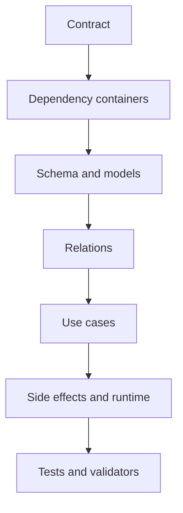
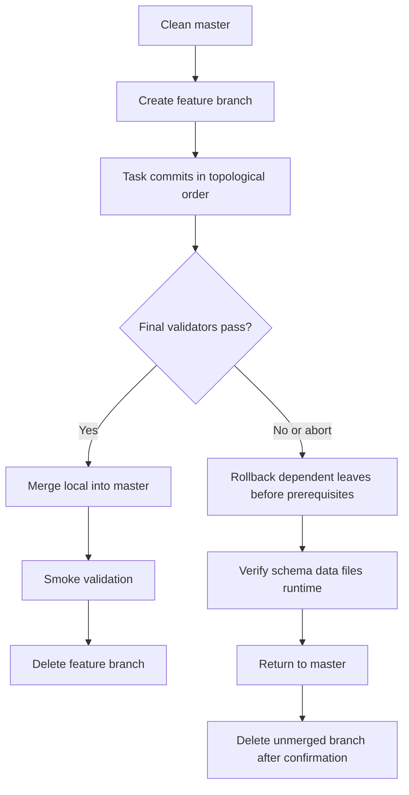

# Workflow Artifact, Git Lifecycle và Rollback

## 1. Artifact location

Workflow topo đầy đủ phải được lưu ngoài repo:

```txt
$HOME\Downloads\Current Task\YYYY-MM-DD-HHmmss-<feature-slug>-workflow.md
```

Trên PowerShell:

```powershell
$targetRoot = Join-Path $HOME 'Downloads\Current Task'
$targetFile = Join-Path $targetRoot '<timestamp>-<feature-slug>-workflow.md'
```

Quy tắc:

1. Resolve `$HOME`, không hardcode username.
2. Kiểm tra `Downloads`; nếu thiếu thì tạo `Downloads` rồi tạo `Current Task`.
3. Không ghi vào `~/.factory/artifacts`.
4. Dùng timestamp tới giây; nếu file vẫn tồn tại, thêm suffix `-01`, `-02` sau khi kiểm tra `Test-Path`.
5. Đọc lại file sau khi ghi và xác nhận:
   - title/scope;
   - hai Mermaid diagrams;
   - task 0 và final gate;
   - commit/rollback trong mọi task;
   - reverse-topological abort section.

Chat chỉ trả summary ngắn và clickable/file path; không lặp toàn bộ artifact.

## 2. Markdown structure

```txt
# <Feature> Topological Workflow
Metadata
Observation / Inference / Decision
Scope A -> A'
Assumptions / Stop conditions
Forward dependency diagram
Git complete/abort diagram
Task 0 Git preflight
Task 1..N
Reverse-topological abort
Rollback manifest
Final local merge and cleanup
Definition of Done
Integrity review
```

## 3. Diagram templates

Dependency:



Lifecycle:



Diagram nodes phải dùng business names thật của workflow, không giữ label generic nếu đã biết dependency.

## 4. Git preflight

Task 0 phải ghi exact branch:

```txt
feature/<feature-slug>
```

Preflight:

```powershell
git status
git diff
git diff --cached
git branch --show-current
git rev-parse HEAD
$mergeHead = git rev-parse --git-path MERGE_HEAD
$cherryPickHead = git rev-parse --git-path CHERRY_PICK_HEAD
$rebaseMerge = git rev-parse --git-path rebase-merge
$rebaseApply = git rev-parse --git-path rebase-apply
Test-Path -LiteralPath $mergeHead
Test-Path -LiteralPath $cherryPickHead
Test-Path -LiteralPath $rebaseMerge
Test-Path -LiteralPath $rebaseApply
```

Nếu bất kỳ `Test-Path` nào trả `True`, dừng vì Git operation đang dang dở.

Dừng nếu:

- branch không phải `master`;
- working tree có tracked/untracked user-owned changes;
- merge/rebase/cherry-pick đang dang dở;
- feature branch đã tồn tại nhưng provenance chưa rõ.

Không tự stash, clean, reset, overwrite hoặc force checkout.

Sau khi sạch:

```powershell
git switch -c 'feature/<feature-slug>'
```

Ghi `base_commit` từ `git rev-parse HEAD` vào metadata artifact. Không tạo commit rỗng cho task 0.

## 5. Commit contract per task

Mỗi task có:

| Field         | Nội dung                                    |
| ------------- | ------------------------------------------- |
| Stage scope   | Exact file allowlist thuộc task             |
| Validation    | Commands phải pass trước stage/commit       |
| Message       | Exact Conventional Commit message           |
| Secret review | `git diff --cached` và config/env/log check |
| Remote        | `No push`                                   |

Ví dụ:

```txt
Commit:
- Stage: app/Containers/AppSection/Product/Data/Migrations/...,
  app/Containers/AppSection/Product/Models/Product.php
- Message: feat(product): add product persistence foundation
- Pre-commit: scoped PHPUnit, php-cs-fixer, Psalm
- No push
```

Không dùng glob rộng để stage. Nếu generator tạo file động, chạy generator trước rồi ghi đầy đủ danh sách file thực tế vào allowlist trước `git add`.

Không amend/squash task trước. Mỗi implementation task có thay đổi file tương ứng đúng một commit. Git preflight, final merge gate và abort-only steps không tạo commit rỗng.

Artifact phải duy trì rollback manifest:

| Task | Depends on | Commit hash             | Migration paths | Rollback command  | Status                   |
| ---- | ---------- | ----------------------- | --------------- | ----------------- | ------------------------ |
| 1    | 0          | `<filled after commit>` | `<exact paths>` | `<exact command>` | pending/done/rolled-back |

`Depends on` phải phản ánh dependency edges thật, để rollback graph phân nhánh không phụ thuộc duy nhất vào số task.

## 6. Rollback contract per task

Mỗi task phải trả lời:

1. Điều kiện nào kích hoạt rollback?
2. Dừng producer/worker nào trước?
3. Data/file cần phục hồi trước khi schema biến mất không?
4. Exact migration path và rollback command là gì?
5. Exact commit nào được revert?
6. Validation nào chứng minh rollback thành công?
7. Có nguy cơ mất dữ liệu hoặc irreversible không?

Template:

```txt
Rollback:
- Trigger:
- Preconditions/backup:
- Stop runtime:
- Data/storage compensation:
- Migration rollback:
- Code/config revert:
- Validation:
- Irreversible risk:
```

Migration rollback không được chỉ ghi `php artisan migrate:rollback`. Phải ghi path/batch expectation và assertions, ví dụ table/column/FK/index tồn tại hoặc không tồn tại sau rollback.

Data backfill phải có reverse transform hoặc đánh dấu irreversible. Nếu irreversible, workflow phải dừng trước execution để user chốt backup/recovery.

## 7. Abort toàn workflow

Abort order được tính từ dependency edges trong rollback manifest, không chỉ đảo số task:

```txt
all completed/started leaf tasks
-> their prerequisites after all dependents are rolled back
-> Task 0 branch cleanup
```

Không mặc định dùng:

```txt
git reset --hard
git clean
git branch -D
```

Nếu task hiện tại chưa commit:

1. Rollback runtime/data/migration đã chạy.
2. Restore tracked files bằng exact allowlist của task.
3. Xóa chỉ các untracked files nằm trong exact allowlist và được task hiện tại tạo.
4. Không dùng broad glob và không xóa file chưa xác minh provenance.
5. Chạy rollback validation trước khi tiếp tục với commits cũ hơn.

Sau khi rollback pass:

1. Xác nhận master không bị thay đổi.
2. Chuyển về master.
3. Nếu feature branch chưa merge, yêu cầu xác nhận rõ trước force-delete.
4. Xóa branch local theo quyết định user.
5. Không push.

Trước mỗi `git revert`, migration rollback hoặc branch switch:

```powershell
git status
git diff
git diff --cached
```

Dừng nếu xuất hiện user-owned changes mới.

## 8. Complete workflow

Khi mọi validator pass:

```powershell
git rev-parse HEAD
git switch 'master'
git merge-base --is-ancestor '<base_commit>' 'master'
git merge --no-ff 'feature/<feature-slug>'
```

Sau merge:

1. Chạy exact smoke commands đã ghi trong artifact, không dùng cụm từ chung chung “chạy smoke test”.
2. Xác nhận mọi task commit reachable từ master.
3. Xác nhận working tree sạch.
4. Xóa branch:

```powershell
git branch -d 'feature/<feature-slug>'
```

Nếu merge hoặc smoke validation fail, giữ branch và dừng. Không push.
